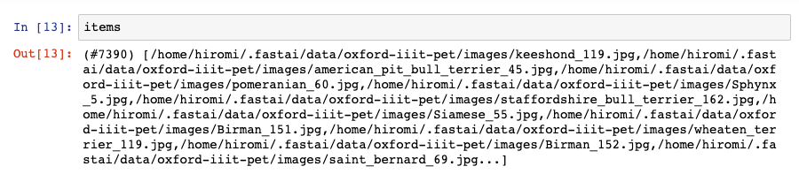

# Code Walkthrough #1

Code repo: https://github.com/fastai/fastai_dev

`dev` folder has all the notebooks

At the root of the repo, there is `environment.yml` to create a conda environment.

Alternative way is to do:

```bash
conda install -c fastai -c pytorch jupyter "pytorch>=1.2.0" torchvision matplotlib pandas requests pyyaml fastprogress pillow scipy
pip install typeguard jupyter_nbextensions_configurator
```

Pytorch version must be greater than 1.2 (don't use the one from master). Should work fine with Python 3.6 or 3.7 (3.7 might be the safest). 

One more thing Jeremy would like you to do after cloning the repo:

- Run `tools/run-after-git-clone` (just once after cloning). It sets things up so that if you were to create a PR, it cleans the notebook by removing extraneous things that tends to cause conflicts. It installs git hook post-merge which will run a script that removes extraneous stuff.

Once V2 is released, there will be a book published.

Swift development is separate from V2. Swift portion is waiting on MLIR and new runtime, meta programming things. 


## Notebooks

You might be tempted to start with 01 notebook, but that would be a "very enthusiatic" approach because notebook 01 is the most complicated. The reason it's the most complicated is it sets up python the way we wanted. Starts with metaclasses, decorators, type checking, monkey patching, and context managers.


### Notebook 08 [[24:47](https://youtu.be/44pe47sB4BI?t=1487)]

08_pets_tutorial.ipynb is a tutorial notebook and doesn't define any functionality. It shows how to use some functionality from the first seven notebooks.

The notebook starts with a number of imports, and they are coming from `local.blah`

```python
from local.data.transform import *
from local.data.pipeline import *
from local.data.source import *
from local.data.core import *
```

  can be simplified as 

```python
from local.data.all import *
```


Why local? As you can see, `faster_dev/dev` has `local` folder.

07_vision_core.ipynb [[26:02](https://youtu.be/44pe47sB4BI?t=1562)] 

 ```python
#default_exp vision.core
#default_cls_lvl 3
 ```

The first line says this notebook will create a python module called `local/vision/core.py`. 

The following cell that starts with `#export` tells it to include everything in this cell in the exported python module:

```python
#export
from local.torch_basics import *
from local.test import *
from local.data.all import *
from local.notebook.showdoc import show_doc

from PIL import Image
```


But it makes a few modifications:

```python
from local.imports import *
```

gets converted to:

```python
from ..imports import *
```

`local` is special and it refers to the local repo's version of fastai v2. So in order to export a proper set of modules, it has to replace `local` with an appropriate relative module path.

But most of the time, `#export` will export the cell contents as is.

At the bottom of the notebook, you'll see the cell that looks like:

```python
#hide
from local.notebook.export import notebook2script
notebook2script(all_fs=True)
```

When you run this cell, it converts all the notebooks to python files. It takes about a second. These python files can be viewed with your local IDE. But what Jeremy request you do most of the time is instead to read, edit, and use the notebooks since they have a lot more information such as examples, pictures, notes, etc. 

The second line at the top of the notebook (`#default_cls_lvl 3`) just indicates the heading level of the auto generated documentation in http://dev.fast.ai/

Notebooks also contains lots of functions that start with `test` which does 2 things:

1. This will appear in the documentation and tells you what the result of something is so you understand how it works

2. It is also creating a test. README tells you how to run the tests in parallel:

   ```python
   for i in {0,1,2}*.ipynb; do sleep 1; python run_notebook.py --fn $i & done
   ```

   Test functions can be found in `00_test.ipynb`

   

### 08_pets_tutorial.ipynb [[35:04](https://youtu.be/44pe47sB4BI?t=2104)]

```python
from local.imports import *
```

`local.imports` is special as it is the only python mldule which is not created by a notebook. 

Jeremy is thinking about splitting some of this out into a core library that doesn't require PyTorch, others that do, testing, notebook stuff, etc.

- Data gets downloaded under `.fastai/data`
- `get_image_files` calls `get_files`. Extremely fast way to grab files in a directry (with an option for recursion).

This notebook does a lot of things with minimum amount of fastai.`RandomSplitter` returns a function to return dataset. Why capital letter? Because they decided that anything that when we call it and returns something which you still then have to call things on, we use capital letters. `RandomSplitter` is a function that returns a function, that's why it's capitalized.

```python
def resized_image(fn:Path, sz=128):
    x = Image.open(fn).resize((sz,sz))
    # Convert image to tensor for modeling
    return tensor(array(x)).permute(2,0,1).float()/255.
```

`resized_image` opens an image, resizes it, and returns a tensor with channel first.


```python
class TitledImage(tuple):
    def show(self, ctx=None, **kwargs): show_titled_image(self, ctx=ctx, **kwargs)
```

`TitledImage` has a `show` function. There is a `show_titled_image`, so why do we need this class? This is the first bit of new API. Any class that has a show method is something which can be used by the whole fastai transformation system and allow `.show()` to work. It is going to try and find a type which has a `show` method. 


```python
class PetTfm(Transform):
    def __init__(self, vocab, o2i, lblr): self.vocab,self.o2i,self.lblr = vocab,o2i,lblr
    def encodes(self, o): return resized_image(o), self.o2i[self.lblr(o)]
    def decodes(self, x)->TitledImage: return x[0],self.vocab[x[1]]
```

`PetTfm` has type annotation on the return. This is a big difference between fastai v2 and fastai v1, and other Python library for that matter. V2 uses type annotation a lot - not for type checking but to make certain behaviors happen. Which bring us to Transform.

### Transform[[43:45](https://youtu.be/44pe47sB4BI?t=2625)]

Transform is a reversible function which can encode and decode. In `PetTfm`'s case, it can encode a path into a tuple of an image and a label, or it can decode a tuple of an image and a labled into a `TitledImage` object. As you can see, it's actually returning a tuple (not a `TitledImage` object). The reason for that is that the return type annotations in fastai `Transform`'s actually "cast". They actually cast the data into this type. It's not just descriptive or documentation - it's actually changing the behavior. 


Here, `dec` actually has tye type of `__main__.TitledImage`. For experienced Python programmer, this is going to be extremely surprising because Python doesn't normally work this way. But we found it unbelievabably useful. It has made our code simpler, shorter, less buggy. 

### Here is what you have to do [[46:01](https://youtu.be/44pe47sB4BI?t=2761)]

If you want to create a function that can convert a path into an iamge and a label, instead of using `PetTfm.encode`, you could have done:

```python
def pet_fn(o): return resized_image(o), o2i[labeller(o)]
x,y = pet_fn(items[0])
show_image(x)
```

But the issue with this is that neither `x` nor `y` has any semantics. The type of `y` is `int`. How do we know how to display that? How do we know what it is? How do we know what it represent? How do we do things to it? `x` is a tensor. We know it's not just a tensor. We know it's a tensor that represent a three-channel image. We should be able to rotate it, brighten it, or flip it. In Python, there is no domain-specific semantics associated with a tensor. In fast v2, we add these semantics to these tensors.


In this case, what I really want to do is:

```python
def pet_fn(o): return TitledImage((resized_image(o), o2i[labeller(o)]))
t = pet_fn(items[0])
t.show()
```


Now we are getting closer. You can kind of see if we add types to things, we can give things functionality. Then the users of the library can just rely on things (e.g. we can always say `.show` or if something is representing an image, I can do `.rotate`, etc). That's one piece of this.

The second piece is, it is not okay to see 21 (the image above), we want to see great pyrenees. Everything that changes your data in a way that removes the ability to know what that data is, it should always be able to go back to where we came from (i.e. to be able to display "great pyrenese" instead of "21") . This is what our `Transform` subclasses are.

### `Transform` [[50:25](https://youtu.be/44pe47sB4BI?t=3025)]

```python
class PetTfm(Transform):
    def __init__(self, vocab, o2i, lblr): self.vocab,self.o2i,self.lblr = vocab,o2i,lblr
    def encodes(self, o): return resized_image(o), self.o2i[self.lblr(o)]
    def decodes(self, x)->TitledImage: return x[0],self.vocab[x[1]]
```

`Transform` class takes some input data, convert it into something which you can get closer to modeling with (but losing information). It also know how to reverse it. In this case, it needs to store the vocab of pet breed. To store these "states", these things have to be classes. `PetTfm` constructor takes the vocab, o2i (the reverse mapping).

`uniqueify` returns a list of unique values in sorted order as well as the reverse mapping (`bidir=True`).

`RegexLabeller` matches the path of an image with a regex and figure out the label.


```python
labeller = RegexLabeller(pat = r'/([^/]+)_\d+.jpg$')
vals = list(map(labeller, items[split_idx[0]]))
vocab,o2i = uniqueify(vals, sort=True, bidir=True)
pets = PetTfm(vocab,o2i,labeller)
```


Summary:

1.  Create a function (i.e. labeller) that will convert paths into pet breed strings.

2. Label everything in the training set (`items[split_idx[0]]` is the training set)

3. Create our vocab and the reverse mapping

4. Send these three things to `PetTfm`

   

```python
x,y = pets(items[0])
x.shape,y
```

If you treat a transform object as if it were a function (i.e. `pet()`), it will call `encodes` function for you.


```python
dec = pets.decode((x,y))
dec.show()
```

`pets.decode` will call `decodes` function for you (notice the missing `s`). 

 

#### What are `items`? [[55:56](https://youtu.be/44pe47sB4BI?t=3356)]

`items` is the result of `get_image_files()` and it is a list of paths, but it doesn't look like most lists.



It starts out with how many items are in the list, and it'll show you the first ten things followed by `...`. We are also indexing into it with a list (`items[split_ids[0]]`) which you can't do with Python list. Jeremy did not really like how Python list works, so he created his own.

```python
type(items)
local.core.L
```

This is the only thing that has a one letter name in all of fastai v2. Since it's actually something that totally replace a list and we always use this instead of a list, so it deserves the very special one letter name.

```python
a = L(1, 2, 5, 7)
```

- You can index into it with a list `a[1,2,0]` 
- Unlike list, you don't have to put it in `[]` (the equivalent of above would be `list([1, 2, 3])`)
- You can also index into it with a mask `a[False,True,True,False]`
- You can add an element by using `+` (i.e. `a + 9` instead of `b + [9]` )
- You can prepend like so `9 + a`
- You can multiply `a * 5` will be `(#20) [1,2,5,7,1,2,5,7,1,2...]`
- You can do list comprehension `L(o*2 for o in a)` or more interestingly `a.mapped(operator.neg)` which will negate items in the `L`.
- And much more

#### Try 2 [[1:00:05](https://youtu.be/44pe47sB4BI?t=3605)]

Create state internally:

```python
class PetTfm(Transform):
    def __init__(self, items, train_idx):
        self.items,self.train_idx = items,train_idx
        self.labeller = RegexLabeller(pat = r'/([^/]+)_\d+.jpg$')
        vals = map(self.labeller, items[train_idx])
        self.vocab,self.o2i = uniqueify(vals, sort=True, bidir=True)

    def encodes(self, i):
        o = self.items[i]
        return resized_image(o), self.o2i[self.labeller(o)]
    
    def decodes(self, x)->TitledImage: return x[0],self.vocab[x[1]]
```


This time, we are going to pass a list of path names and training set indeces:

```python
pets = PetTfm(items, split_idx[0])
```


### `Pipeline`[[1:01:55](https://youtu.be/44pe47sB4BI?t=3715)]

In deep learning, you almost always have a number of steps from raw input to your modeling data. `Pipeline` lets you apply a number of Transforms in order and compoese them all together.

Here is how to create a Siamese dataset. Siamese deep learning typically has two items and a boolean. So it can be two images of dogs and a boolean that tells you whether they are the same breed. For things like facial recognition, you do not want to create a model of every single person's face. Instead, we create a model that says whether this face is of the same person as this face.   

```python
class SiamesePair(Transform):
    def __init__(self,items,labels):
        self.items,self.labels,self.assoc = items,labels,self
        sortlbl = sorted(enumerate(labels), key=itemgetter(1))
        # dict of (each unique label) -> (list of indices with that label)
        self.clsmap = {k:L(v).itemgot(0) for k,v in itertools.groupby(sortlbl, key=itemgetter(1))}
        self.idxs = range_of(self.items)
        
    def encodes(self,i):
        "x: tuple of `i`th image and a random image from same or different class; y: True if same class"
        othercls = self.clsmap[self.labels[i]] if random.random()>0.5 else self.idxs
        otherit = random.choice(othercls)
        return (self.items[i], self.items[otherit], self.labels[otherit]==self.labels[i])
```


The interesting bit is in `encode`. `self.clsmap[self.labels[i]] if random.random()>0.5 else self.idxs` will randomly decide 50% whether or not the second image is going to be of the same breed as the first image. It returns a triplet tuple with two images and a boolean. 


Secondly, we need to open and resize:

```python
class OpenAndResize(Transform):
  as_item_force = False
  def encodes(self, x:Path): return resized_image(x)
```


Then we need to do these two things in order. So we use `Pipeline`

```python
labeller = RegexLabeller(pat = r'/([^/]+)_\d+.jpg$')
sp = SiamesePair(items, items.mapped(labeller))
pipe = Pipeline([sp, OpenAndResize])
x,y,z = t = pipe(0)
x.shape,y.shape,z
```


And to show this, we need something with a show method:

```python
class SiameseImage(tuple):
    def show(self, ctx=None, **kwargs): 
        img1,img2,same_breed = self
        return show_image(torch.cat([img1,img2], dim=2), title=same_breed, ctx=ctx)
```


Now we put three things in:

```python
pipe = Pipeline([sp, OpenAndResize, SiameseImage])
```


### A few cool things [[1:05:55](https://youtu.be/44pe47sB4BI?t=3955)]

#### `L.itemgot`

In Python, you can do 

```python
f = operator.itemgetter(0)
t = [[1,2], [3,4]]
list(map(f,t))
```

```
[1,3]  # get you 0th things from each list
```

`L(v).itemgot(0)` will do these steps at once.


#### `L.attrgot`

This will grab a particular named attributes from everything in a `L`. This also handles defaults for things that are missing, etc.


#### `Pipeline` - Transformers with different number of inputs/outputs

`SiamesePair` returned a tuple of three items - two images with one boolean. The second thing in the pipeline is `OpenAndResize` takes in a path and return a resized image. How can we possibly be applying `resized_image` function to a tuple? You can't. The trick is this type annotation:

```python
def encodes(self, x:Path)
```

This is not a return annotation. It's a parameter annotation. This tells the transform system that this particular encodes only works on `Path`. 

We can make the OpenAndResize a little simpler:

```python
class OpenAndResize(TupleTransform):
  def encodes(self, x:Path): return resized_image(x)
```

There is a subclass of `Transform` called `TupleTransform` - if it gets a tuple, it will run `encodes` on every element of the tuple separately, and it will only apply it to element of a given type. If the element is not of this type, it will ignore and pass them through.

This is super useful for data augmentation. It can have multiple `encodes` functions with different types, and it will automatically pick the right one:

```python
class OpenAndResize(TupleTransform):
  def encodes(self, x:Path): return ...
  def encodes(self, x:Int): return ...
```

This is great for things like defining a single data augmentation which behaves differently for images, masks, etc.

`TupleTransform` is simply a `Transform` with `as_item_force=False`.


### `TfmdDS` [[1:12:18](https://youtu.be/44pe47sB4BI?t=4338)]

`TfmdDS` (transformed dataset) applies transforms/`Pipeline` to a list of items.

```python
tfms = [[PILImage.create, ImageResizer(128), ToTensor(), ByteToFloatTensor()],
        [labeller, Categorize()]]
tds = TfmdDS(items, tfms)
```

It gives us back `tds` which is something we can index into. Note: transforms get lazily applied to items.

```python
t = tds[0]
type(t[0]),type(t[1])
```


Notice `tfms` is a list of a list of transforms (not a typo). In deep learning, you nearly always have at least an independent variable and a dependent variable (i.e. `x` and `y`). The first list defines the transforms in the `Pipeline` to create your independent variable list, and the second is to create the dependent variable. You can have as many as you like, but the vast majority of the time, it will be two.


 Why lazily? It's possiblye to take the entire list of items and apply the pipeline at once and store it in memory. But it takes a long time for something like ImageNet and images are too big to store them all in memory. Also, transforms will often have random stuff such as Siamese transform or data augmentation. So in practice, we want transforms to be applied only at the moment when we actually asked for a particular item.  


### CPU vs. GPU [[1:18:13](https://youtu.be/44pe47sB4BI?t=4693)]

When doing stuff like ImageNet, it tends to use up a lot of CPU to do transformations which is the bottleneck. 

Nearly all the complex transformations in fastai v2 actually run on GPU, and part of the reason it's possible is because of the type system. 


Another thing to notice is, `ImageResizer` defines `encodes` twice:

```python
class ImageResizer(Transform):
    order=10
    "Resize image to `size` using `resample"
    def __init__(self, size, resample=Image.BILINEAR):
        if not is_listy(size): size=(size,size)
        self.size,self.resample = (size[1],size[0]),resample

    def encodes(self, o:PILImage): return o.resize(size=self.size, resample=self.resample)
    def encodes(self, o:PILMask):  return o.resize(size=self.size, resample=Image.NEAREST)
```

Normally, in Python, the last one would override the first one. But because it is a Transform subclass, there is this magic dispatch stuff happening. If it receives a pillow image, it will resample using bilinear resampling. If it receives a pillow mask, it will resample it with a nearest neighbor. This is important because for masks, you can't do bilinear resampling (because you'll end up with floats instead of ints). This is an example of this type dispatch system to automatically dispatch your function to the right behavior depending on what kind of data you are using.  

Generally speaking, most of the fastai v2 types will have `.create` class method which is used to create one of those things. 

