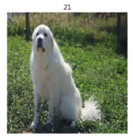

# Code Walkthrough #1

Code repo: https://github.com/fastai/fastai_dev

`dev` folder has all the notebooks

At the root of the repo, there is `environment.yml` to create a conda environment.

Alternative way is to do:

```bash
conda install -c fastai -c pytorch jupyter "pytorch>=1.2.0" torchvision matplotlib pandas requests pyyaml fastprogress pillow scipy
pip install typeguard jupyter_nbextensions_configurator
```

Pytorch version must be greater than 1.2 (don't use the one from master). Should work fine with Python 3.6 or 3.7 (3.7 might be the safest). 

One more thing Jeremy would like you to do after cloning the repo:

- Run `tools/run-after-git-clone` (just once after cloning). It sets things up so that if you were to create a PR, it cleans the notebook by removing extraneous things that tends to cause conflicts. It installs git hook post-merge which will run a script that removes extraneous stuff.

Once V2 is released, there will be a book published.

Swift development is separate from V2. Swift portion is waiting on MLIR and new runtime, meta programming things. 


## Notebooks

You might be tempted to start with 01 notebook, but that would be a "very enthusiatic" approach because notebook 01 is the most complicated. The reason it's the most complicated is it sets up python the way we wanted. Starts with metaclasses, decorators, type checking, monkey patching, and context managers.


### Notebook 08 [[24:47](https://youtu.be/44pe47sB4BI?t=1487)]

08_pets_tutorial.ipynb is a tutorial notebook and does define any functionality. It shows how to use some functionality from the first seven notebooks.

The notebook starts with a number of imports, and they are coming from `local.blah`

```python
from local.data.transform import *
from local.data.pipeline import *
from local.data.source import *
from local.data.core import *
```

  can be simplified as 

```python
from local.data.all import *
```


Why local? As you can see, `faster_dev/dev` has `local` folder.

07_vision_core.ipynb [[26:02](https://youtu.be/44pe47sB4BI?t=1562)] 

 ```python
#default_exp vision.core
#default_cls_lvl 3
 ```

The first line says this notebook will create a python module called `local/vision/core.py`. 

The following cell that starts with `#export` tells it to include everything in this cell in the exported python module:

```python
#export
from local.torch_basics import *
from local.test import *
from local.data.all import *
from local.notebook.showdoc import show_doc

from PIL import Image
```


But it makes a few modifications:

```python
from local.imports import *
```

gets converted to:

```python
from ..imports import *
```

`local` is special and it refers to the local repo's version of fastai v2. So in order to export a proper set of modules, it has to replace `local` with an appropriate relative module path.

But most of the time, `#export` will export the cell contents as is.

At the bottom of the notebook, you'll see the cell that looks like:

```python
#hide
from local.notebook.export import notebook2script
notebook2script(all_fs=True)
```

When you run this cell, it converts all the notebooks to python files. It takes about a second. These python files can be viewed with your local IDE. But what Jeremy request you do most of the time is instead to read, edit, and use the notebooks since they have a lot more information such as examples, pictures, notes, etc. 

The second line at the top of the notebook (`#default_cls_lvl 3`) just indicates the heading level of the auto generated documentation in http://dev.fast.ai/

Notebooks also contains lots of functions that start with `test` which does 2 things:

1. This will appear in the documentation and tells you what the result of something is so you understand how it works

2. It is also creating a test. README tells you how to run the tests in parallel:

   ```python
   for i in {0,1,2}*.ipynb; do sleep 1; python run_notebook.py --fn $i & done
   ```

   Test functions can be found in `00_test.ipynb`

   

### 08_pets_tutorial.ipynb [35:04](https://youtu.be/44pe47sB4BI?t=2104)

```python
from local.imports import *
```

`local.imports` is special as it is the only python mldule which is not created by a notebook. 

Jeremy is thinking about splitting some of this out into a core library that doesn't require PyTorch, others that do, testing, notebook stuff, etc.

- Data gets downloaded under `.fastai/data`
- `get_image_files` calls `get_files`. Extremely fast way to grab files in a directry (with an option for recursion).

This notebook does a lot of things with minimum amount of fastai.`RandomSplitter` returns a function to return dataset. Why capital letter? Because they decided that anything that when we call it and returns something which you still then have to call things on, we use capital letters. `RandomSplitter` is a function that returns a function, that's wh y it's capitalized.

```python
def resized_image(fn:Path, sz=128):
    x = Image.open(fn).resize((sz,sz))
    # Convert image to tensor for modeling
    return tensor(array(x)).permute(2,0,1).float()/255.
```

`resized_image` opens an image, resize it, and return a tensor with channel first.


```python
class TitledImage(tuple):
    def show(self, ctx=None, **kwargs): show_titled_image(self, ctx=ctx, **kwargs)
```

`TitledImage` has a `show` function. There is a `show_titled_image`, so why do we need this class? This is the first bit of new API. Any class that has a show method is something which can be used  by the whole fastai transformation system and allow `.show()` to work. It is going to try and find a type which has a `show` method. 


```python
class PetTfm(Transform):
    def __init__(self, vocab, o2i, lblr): self.vocab,self.o2i,self.lblr = vocab,o2i,lblr
    def encodes(self, o): return resized_image(o), self.o2i[self.lblr(o)]
    def decodes(self, x)->TitledImage: return x[0],self.vocab[x[1]]
```

`PetTfm` has type annotation on the return. This is a big difference between fastai v2 and fastai v1, and other Python library for that matter. V2 uses type annotation a lot - not for type checking but to make certain behaviors happen. Which bring us to Transform.

### Transform[[43:45](https://youtu.be/44pe47sB4BI?t=2625)]

Transform is a reversible function which can encode and decode. In `PetTfm`'s case, it can encode a path into a tuple of an image and a label, or it can decode a tuple of an image and a labled into a `TitledImage` object. As you can see, it's actually returning a tuple (not a `TitledImage` object). The reason for that is that the return type annotations in fastai `Transform`'s actually "cast". They actually cast the data into this type. It's not just descriptive or documentation - it's actually changing the behavior. 


Here, `dec` actually has tye type of `__main__.TitledImage`. For experienced Python programmer, this is going to be extremely surprising because Python doesn't normally work this way. But we found it unbelievabably useful. It has made our code simpler, shorter, less buggy. 

### Here is what you have to do [[46:01](https://youtu.be/44pe47sB4BI?t=2761)]

If you want to create a function that can convert a path into an iamge and a label, instead of using `PetTfm.encode`, you could have done:

```python
def pet_fn(o): return resized_image(o), o2i[labeller(o)]
x,y = pet_fn(items[0])
show_image(x)
```

But the issue with this is that neither `x` nor `y` has no semantics. The type of `y` is `int`. How do we know how to display that? How do we know what it is? How do we know what it represent? How do we do things to it? `x` is a tensor. We know it's not just a tensor. We know it's a tensor that represent a three-channel image. We should be able to rotate it, brighten it, or flip it. In Python, there is no domain-specific semantics associated with the tensor. In fast v2, we add these semantics to these tensors.


```python
def pet_fn(o): return TitledImage((resized_image(o), o2i[labeller(o)]))
t = pet_fn(items[0])
t.show()
```



Now we are getting closer. 