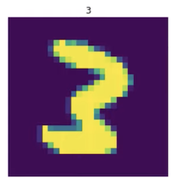

# Code Walkthrough #2

[Video](https://youtu.be/yEe5ZUMLEys)


08_pets_tutorial.ipynb

What we covered so far:

- `Transform` which has `encodes` method (similarly to now `nn.Module` class has `forward` function). `decodes` method will undo the transformation to the point that it can display it (i.e. converts to something with `show` method).
- `Pipeline` - compose `Transform`'s together. The interesting thing is that when a `Transform` subclass returns a tuple, it can be followed by `TupleTransform` which applies `encodes` only to items with a specified type in the tuple.  
- You can also do `pipe.decode(t)` to undo what a Pipeline did (e.g. from images to tensors)
- `pipe.show()` will go back in the pipeline (by calling `decodes`) until it gets to a type with `show` method defined.  
- `TfmdDS` - something we give arrays of transforms/functions, each one will be turned into a pipeline, and each pipeline will be applied to each item, that will then give us a tuple.
- `TfmdDS` can `decode` a PILImage and an integer into a tensor and a label such as "great_pyrenees"
- `TfmdDS.show` will decode until it has a type with `show` method and display it.


### `TfmdDL`[[8:22](https://youtu.be/yEe5ZUMLEys?t=502)]

A data loader which understands fast v2 stuff. Specifically 1. how to maintain types, 2. Decoding. 

Data loaders also have palces you can add transform pipelines (`after_item`). After creating a dataset, it is going to apply these transforms in the data loader. 


### DataSource [[12:43](https://youtu.be/yEe5ZUMLEys?t=763)]

 DataSource is basically a transformed dataset, but with the ability to create separate training and validation sets (or as many subsets as you'd like).

`filts`: give it an array of lists with indices (ones for training, and ones for validation). 

You can use DataSource exactly like `TfmdDS` by indexing into it `pets[0]` , but you can also ask for a `subset` (e.g. `pets.subset(1)[0]` will give us the 0th item in the items in `split_idx[1]`). `pets.subset(1)` is the same as `pets.valid` (its type is `TfmdDS`). 

`TfmdDL(..., afer_item=...)` - will specify transforms that runs on each individual tuple that comes out of the transform pipeliens.

`TfmdDL(..., afer_batch=...)` - will specify transforms that run after the tuples have been collated together by the PyTorch DataLoader into a single batch. This is where you put transforms that run on a whole batch at a time, and it means we have the ability to easily run GPU transforms (e.g. `Cuda` to move it to GPU, `ByteToFloatTensor` which is slow because floats are much bigger than bytes and takes non-trivial amount of time on CPU).

Thanks to broadcast tensor computations, we don't normally have to write it at all differently to make it work at a batch level:


So often you'll be able to just transparently move your transformations onto the GPU and suddenly things will just run much faster.

You can do `train_dl.show_batch()` also.

#### Neat subtlety of `Categorize`  [[20:34](https://youtu.be/yEe5ZUMLEys?t=1234)]

What happens when `Pipeline` first gets its data source is, it calls a special method in `Transform` called `setup` (if you have one). As you can see, it creates category's vocab using just training set (as it should!).

```python
class Categorize(Transform):
    "Reversible transform of category string to `vocab` id"
    order=1
    def __init__(self, vocab=None, add_na=False):
        self.add_na = add_na
        self.vocab = None if vocab is None else CategoryMap(vocab, add_na=add_na)

    def setup(self, dsrc):
        if self.vocab is None and dsrc: self.vocab = CategoryMap(getattr(dsrc,'train',dsrc), add_na=self.add_na)

    def encodes(self, o): return self.vocab.o2i[o]
    def decodes(self, o)->Category: return self.vocab[o]
```


`ByteToFloatTensor` does not normalize, but it has `div` boolean argument which will divide it by 255. 

Text transformation is rarely done lazily. They are normally done once (pre-processing style), so they are not good match for GPU - but there's nothing to stop you from doing so.

 Why not do all transformation on GPU? To get the speedup from GPU, we need a batch. And to create a batch, you need a tensor and all the items in it need to be the same shape. So without `ImageResizer`, images would be different shapes and we cannot collate them into a batch.

Things you want to do on the CPU:

- Load the JPEG
- Make them all the same shape
- Convert them into a tensor

NVIDIA DALI allows to do stuff on things that are not all the same size, so once it stabilizes, it may change this.

### Another example: Segmentation [[24:30](https://youtu.be/yEe5ZUMLEys?t=1470)]

```python
cv_source = untar_data(URLs.CAMVID_TINY)
cv_items = get_image_files(cv_source/'images')
cv_splitter = RandomSplitter(seed=42)
cv_split = cv_splitter(cv_items)
cv_label = lambda o: cv_source/'labels'/f'{o.stem}_P{o.suffix}'
```

```python
tfms = [[PILImage.create], [cv_label, PILMask.create]]
camvid = DataSource(cv_items, tfms, filts=cv_split)
trn_dl = TfmdDL(camvid.train,  bs=4, after_item=ds_img_tfms, after_batch=dl_tfms)
```

The difference to note here is that for `y` transform, `cv_label` grab the name of the mask file from the image file. Then we call `PILMask.create`. `PILMask` is just one line of code. The reason we have it is to have separate `encodes` function from `PILImage`.

Notice even without DataBunch, the "intermediate" code is minimal. 

There is `local/notebook.index.txt` that tells you which notebook everything is in. But the quickest way is:

```python
from local.notebook.showdoc import *
source_link(TfmdDL)
```

And this will give you a link to the notebook with an anchor which will take you to the right area.

### 05_data_core.ipynb [[30:21](https://youtu.be/yEe5ZUMLEys?t=1821)] 

What we are going to learn:

- `get_files`
- `get_image_files`
- `Splitter`
- `Labeller`
- `Categorize`
- `MultiCategorize`
- We'll put all that together with MNIST
- `TfmdDL`

The three major components of data blocks: 1. Get, 2. Split, 3. Label

#### 1. Get

`get_files` take four arguments - `path` to look in, `extensions` to look for, whether or not to search recursively (`recurse`), and folders to `include` in search.

The code generated by this notebook goes into  `local/data/core.py`. 

`__all__` gets generated automatically by fastai's notebook tool. It defines what get imported if you were to do `import *`. Without `__all__`, it imports everything including what's being imported recursively (awful). Since fastai is very careful about what gets exported and how things are structured, `import *` rarely causes issue.

Literate programming.

"Items" for vision, it's normally a list of paths. But an item list could be dataframe, database connection, network pipe, etc. 

`get_files` calls `_get_files` (anything that starts with `_` is not included in `__all__` by fastai).

The key thing to understand in `get_files` is `os.walk(path)`. It is rediculously fast Python API to look for things in your file system.

The way to demonstrate functionality in the documentation is through tests.

There are tests that are not interesting for documentation purposes but are useful as tests, for them, you put `#hide` as the first line of the cell (which will cause it not to be included in docs).

Documentation location: http://dev.fast.ai/

Another example of a function returning a function (hence the camel case):

```python
#export
def FileGetter(suf='', extensions=None, recurse=True, include=None):
    "Create `get_files` partial function that searches path suffix `suf` and passes along args"
    def _inner(o, extensions=extensions, recurse=recurse, include=include):
        return get_files(o/suf, extensions, recurse, include)
    return _inner
```

`get_image_files` calls `get_files` passing in image extensions.

#### 2. Split

`RandomSplitter` randomly permute all the indexes then cut it where you asked

`GrandparentSplitter` looks at the parent of the parent. For MNIST or ImageNet, that would be where you find out train/validation.

#### 3. Label

Take a path, for example, and pull the label out of it.

#### `Categorize`

`Category.create` is `Categorize`.  `Categorize` is a `Transform` so it has `encodes` and `decodes`

`setup` method gets called by `TfmdList`. 

```python
self.vocab = CategoryMap(getattr(dsrc,'train',dsrc), add_na=self.add_na)
```

`getattr(dsrc,'train',dsrc)` - it will use `dsrc.train` if `dsrc` has train attributes, otherwise use `dsrc` (the whole data source).

`CategoryMap` is something which will grab all the unique values in your column, optionally sort them, create `o2i` (object to int). `L` has `val2idx` which is a reverse map of `o2i`. 


#### MultiCategory [[54:40](https://youtu.be/yEe5ZUMLEys?t=3280)]

Just like Planet where each image can have multiple things ('cloudy', 'agriculture', 'primary', etc).

```python
#export
class MultiCategory(L):
    def show(self, ctx=None, sep=';', **kwargs): return show_title(sep.join(self.mapped(str)), ctx=ctx)
```

```python
# export
class MultiCategorize(Categorize):
    "Reversible transform of multi-category strings to `vocab` id"
    def setup(self, dsrc):
        if not dsrc: return
        if self.vocab is None:
            dsrc1 = getattr(dsrc,'train',dsrc)
            vals = set()
            for b in dsrc1: vals = vals.union(set(b))
            self.vocab,self.o2i = uniqueify(list(vals), sort=True, bidir=True)
        setattr(dsrc, 'vocab', self.vocab)

    def encodes(self, o):                return [self.o2i  [o_] for o_ in o]
    def decodes(self, o)->MultiCategory: return [self.vocab[o_] for o_ in o]
```

```python
# export
MultiCategory.create = MultiCategorize
```

```python
cat = MultiCategorize()
tds = TfmdDS([['b', 'c'], ['a'], ['a', 'c']], tfms=[cat])
test_eq(cat.vocab, ['a', 'b', 'c'])
test_eq(cat(['a', 'c']), [0,2])
test_eq(cat([]), [])
test_eq(cat.decode([1]), ['b'])
test_stdout(lambda: tds.show_at(2), 'a;c')
```


As you can see, for multi categyry dependent variable is now a list of lists `[['b', 'c'], ['a'], ['a', 'c']]` , and for showing title, it needs to join strings `sep.join(self.mapped(str))`


`test_stdout` will test whether a function will print out the expected string.


In `05_data_core.ipynb`, MNIST example is not exported. The vision application is not yet created, so we don't want to export anything that uses Pillow yet. But we can certainly include it in the tests.

`test_fig_exists` tests whether a figure was created.


```python
from PIL import Image
def open_img(fn:Path)->Image.Image: return Image.open(fn).copy()
def img2tensor(im:Image.Image)->TensorImage: return array(im)[None]

tfms = [[open_img, img2tensor],
        [parent_label, Categorize()]]
train_ds = TfmdDS(train, tfms)
```

`img2tensor` converts an image into numpy array. A trick to note is that if you pass to `Pipeline` a function (not `Transform`), `Pipeline` converts the function into Transform (e.g. `Transform(img2tensor)`). So this will automatically take the numpy array and cast it into a tensor (`TensorImage`). 


### `TfmdDL` [[1:03:16](https://youtu.be/yEe5ZUMLEys?t=3796)]

It is a subclass of fastai `DataLoader` (not PyTorch's). What `TfmdDL` does is it turns a data loader into something which understands transforms. 

```python
tfms = [[open_img], [parent_label, Categorize()]]
tds = TfmdDS(items, tfms)
tdl = TfmdDL(tds, after_item=img2tensor, bs=4)
b = tdl.one_batch()
test_eq(L(tdl.decode_batch(b)[0]).mapped(type), (TensorImage,Category))
```

The most interesting bit is the test at the bottom. It is testing that the decoded version of the batch, when we map the function `type` over it, it's going to be `TensorImage` and `Category`. Why is this interesting? It is showing that fastai knows how to take a tensor that comes out of a data loader and put the correct types back onto it. This is super handy for interence. In production, your predictions will have proper types so you can actually call methods and transforms on them. 


```python
tdl.decode_batch(b)
```

`b` is a batch with four MNIST images and a list of labels (4 images in one tensor, 4 labels in one tensor, so total of two tensors).

The decoded version of that  `tdl.decode_batch(b)` is nearly the same but now we have four pairs of an image and a label (now a label is a string e.g. `'3'`) which is much more ready for showing.

Now you can do:

```python
show_titled_image(tdl.decode_batch(b)[0])
```



Now what we want to do is something like this:

```python
x, y = tdl.decode_batch(b)[0]
type(x), type(y)
```

But it is a little awkward, so here is the equivalent (`mapped` will map a function over what is in `L`):

```python
L(tdl.decode_batch(b)[0]).mapped(type)
```


Looking `TfmdDL` more:

`TfmdDL` has `one_batch` method (inherited from `DataLoader`).

```python
class NegTfm(Transform):
    def encodes(self, x): return torch.neg(x)
    def decodes(self, x): return torch.neg(x)
    
tdl = TfmdDL(train_ds, after_batch=NegTfm(), bs=4, num_workers=4)
b = tdl.one_batch()
test_eq(type(b[0]), TensorImage)
```

This transformation can be applied to a whole batch at a time because the negative opearator in Python doesn't care what rank something is. So we can put it in `after_batch`. If we had `Cuda` here, it'll negate it on GPU.

The test in the last line is checking to make sure the first item in the batch has a type of `TensorImage`. This is not particularly easy thing to do. For example:

```python
t  = train_ds[0][0]
t2 = torch.neg(t)
```

```python
type(t)
```

local.data.transform.TensorImage

```python
type(t2)
```

torch.Tensor


This works because all the transformation pipelines (`TfmdDL`, `TfmdDS`, etc) all check after it goes through encode or decode that the type doesn't change. If it does change, it will convert the type back to what it used to be (`TensorImage` is a subclass of `torch.Tensor`, and it converts the result to the original subclass). You can opt out of this by putting return type of None like so:

 ```python
def encodes(self, x)->None: return torch.neg(x)
 ```


 #### `Int`

```python
Int??
```

```
Init signature: Int(self, /, *args, **kwargs)
Docstring:      An `int` with `show`
Source:         class Int(int, ShowTitle): pass
File:           ~/git/fastai_dev/dev/local/core.py
Type:           type
Subclasses: 
```


`Int` is a subclass of int which knows how to show title. 

We will see more about type annotation `def decodes(self, x)-> Int: ...` when we see Transforms notebook.


### `@delegates()` [[1:17:27](https://youtu.be/yEe5ZUMLEys?t=4647)]

`TfmdDL` has `@delegates()` decoration at the top.

[Here](https://www.fast.ai/2019/08/06/delegation/) is an article descriving delegation in more detail.

A quick summary:

`TfmdDL` is a subclass of `DataLoader`. So when we call `super().__init__()`, you want to pass along any keyword arguments (`kwargs`) that you gave us. 

Normally, if you put `**kwargs`, there are a couple of issues. If you hit shift+tab to see what arguments a function would accept, it shows up as `kwargs` which is not very informative:


With `@delegates()`, you see actual arguments and tab completion works as well. How does this work? When you put `@delegates` and use `**kwargs` in `__init__`, it remoeves `**kwargs` and replace it with parent class' constructor arguments. 


A notable thing about `TfmdDL` is `show_batch` function. It not only knows how to display a batch, it knows how to combine the information from multiple data types (e.g. an image and a mask).

```python
def show_batch(self, b=None, max_n=10, ctxs=None, **kwargs):
  "Show `b` (defaults to `one_batch`), a list of lists of pipeline outputs (i.e. output of a `DataLoader`)"
  if b is None: b = self.one_batch()
    b = self.decode(b)
    if hasattr(b, 'show'): return b.show(max_n=max_n, **kwargs)
    if ctxs is None:
      if hasattr(b[0], 'get_ctxs'): ctxs = b[0].get_ctxs(max_n=max_n, **kwargs)
        else: ctxs = [None] * len(b[0] if is_iter(b[0]) else b)
          db = self._decode_batch(b, max_n, False)
          ctxs = [self.dataset.show(o, ctx=ctx, **kwargs) for o,ctx in zip(db, ctxs)]
          if hasattr(b[0], 'display'): b[0].display(ctxs)
```


You can send a particular batch to show, or it'll default to one_batch. It will decode after_batch transformations, then decode before_batch transformations. 

`ctxs` is contexts - a context can be a picture and a title in each grid:


For things that display a dataframe, each column/row.

If you don't tell it what contexts to use, it will ask an object in the batch what type to use. It will then decode the batch, and then attempt to call `.show()`. 


####  `compose`

`compose(f, getattr(self.dataset,'decode',noop))`  will call `f` then call `getattr(self.dataset,'decode',noop)`


Generally there are documentation and examples for how the class work first, then underneath you see a subsection called "methods" where it goes through each method and show you how to use each of them separately. 


 


